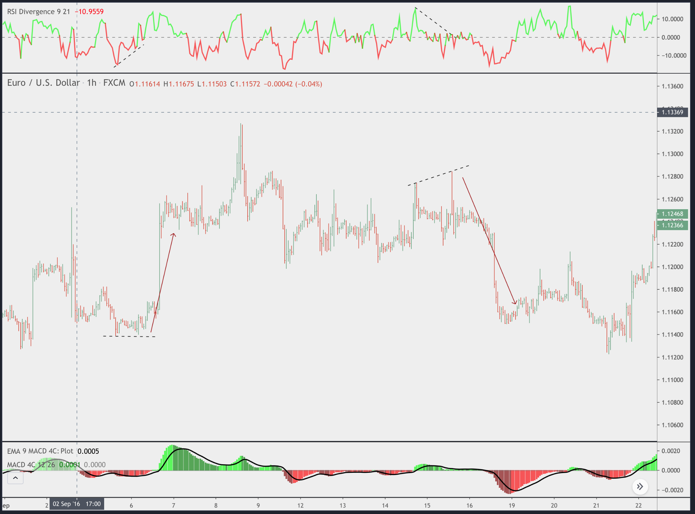

# NOTES

- Green line in 30 minutes , 1 hour is good
- After it passes the previous top level usually 2% or 5% pump is coming up
  (along with increases volume), so it is not good idea to short it
- The rise and fall may play in between %5 to liquidate 20x players
- Do not open leverage more than 19x; 3-5x is safest
- Bots' main goal is to liquidate you in all cost no matter what, even if you
  have 10 cents or 1000$,,they make the token drop down 5% touch the price you
  liquidate and rise back up 40%
- Before buying it look for its BTC graph
- Look for "W", its a good sign for a pump

--------------

- izle: https://www.youtube.com/watch?v=UX4Jcv8vXkk
- yazdigin bot divergence
bulunca wallet balance in 1% i ile pozisyon alsin, pozisyonu kapamak icin aldigi
fiyatin 1% uzagina limit order koysun yani 1% profit ile kapasin

## RSI Divergence




## Strategy Guideline


## Message

```
BUY SIGNAL 15 Minute
==================
{{exchange}}:{{ticker}}, price = {{close}}, volume = {{volume}}
```

-----------------

- Squeeze momentum by LazyBear
- [Custom timeframe indicator by ChrisMoody](
  https://www.tradingview.com/script/OQx7vju0-MacD-Custom-Indicator-Multiple-Time-Frame-All-Available-Options/)
- [VWAP oscillator by filbfilb](https://www.tradingview.com/script/9Zc2BnWa-VWAP-Oscillator/)
- [TonyUX EMA scalper by tux](https://www.tradingview.com/script/egfSfN1y-TonyUX-EMA-Scalper-Buy-Sell/)
- [EMA 20/50/100/200](https://www.tradingview.com/script/48ZWvclR-EMA-20-50-100-200/)


# Alert format example:

```
"ticker": "{{ticker}}",
    "bar": {
        "time": "{{time}}",
        "open": {{open}},
        "high": {{high}},
        "low": {{low}},
        "close": {{close}},
        "volume": {{volume}}
    }
```
